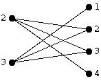

<h2>Maximal Biclique Enumeration</h2>

<ul>
<li>
Introduction: This is an implementation of maximal biclique enumeration algorithm
from Alexe et al.
(<a href="http://citeseer.nj.nec.com/alexe02consensus.html">http://citeseer.nj.nec.com/alexe02consensus.html</a>)
</li>

<li>
Files and usages:
<ul>

<li>
<a href="http://genome.cs.iastate.edu/supertree/download/biclique/max_biclique.zip">max_biclique.zip</a>: The archive package of necessary source files 
and some additional test data file.
</li>

<li>
<a href="bigraph2.h">biclique2.h</a>: The implementation
of the algorithm.</li>

<li>
<a href="bigraph2_MS.h">biclique2_MS.h</a>: The
same class implementation as above but modified for Visual Studio environment. Thanks to Thomas
Sharpless for the contribution.</li>

<li>
<a href="sbtest_ii.cpp">sbtest_ii.cpp</a>: The main program to
handle the file input/output as well as demonstrate how to use the bigraph class.  
To compile it (under Linux or Mac OSX), simply use the command:
<pre>
$ g++ -o sbtest sbtest_ii.cpp
</pre>
To run it, use the command line (all the file names are mandatory): 
<pre>
$ sbtest [input bigraph file] [output bclique file] [output size file]
</pre>
For Visual Studio, please switch to the
simple_biclique2_MS.h header file.</li>

<li>
<a href="http://genome.cs.iastate.edu/supertree/download/biclique/sbtest.linux">sbtest.linux</a>, 
<a href="http://genome.cs.iastate.edu/supertree/download/biclique/sbtest.osx">sbtest.osx</a>,
<a href="http://genome.cs.iastate.edu/supertree/download/biclique/sbtest.sun">sbtest.sun</a>: These are pre-compiled binaries for indicated platforms.
</li>

<li>
<a href="n400-x150-d80.bigraph">n400-x150-d80.bigraph</a>: An
example of a bipartite graph which has 400 nodes in first set, 
150 nodes in second set and around 12000 edges.
A bipartite graph has two node sets, say X and Y.
Each edge is represented by a node x from X and a node y from Y.
The input file consists of a list of edges
where x is in the first column and y is in the second column.
For example, the following bipartite graph is represend as: 
<table cellspacing="0">
<tr align="center">
<th>

</th>
<th width="60%">
<pre>
 2 2
 2 3
 2 4
 3 1
 3 2
 3 3
</pre>
</th>
</tr>
</table>
in a text file.
</li>

<li>
<a href="http://genome.cs.iastate.edu/supertree/download/biclique/n400-x150-d80.biclique">n400-x150-d80.biclique</a>, 
<a href="http://genome.cs.iastate.edu/supertree/download/biclique/n400-x150-d80.size">n400-x150-d80.size</a>:
The output of the above input bipartite graph file. The purpose of providing
these files is  for verification. Please note that the generated
n400-x150-d80.biclique file has size of 18MB, and for this reason, the
file is not included in the archive file. 
In the output file, each biclique is represented by 3 lines:  
[list of nodes from 1st node set] 
[list of nodes from 2nd node set] 
[empty line] 
As the above example, the output bicliques in a file will be:
<pre>
3
1 2 3

2 3
2 3

2
2 3 4

</pre>
</li>

<li>
<a href="bicli_break.py">bicli_break.py</a>: A <a href="http://www.python.org/">python2</a>
script divides the generated bicliques into separated files of single biclique.
Optional cut-off values m and n can be applied to filter out 
unnecessary small bicliques, where m is the minumal size for first node set and n for the second. 
<pre>
$ python bicli_break.py [biclique file] [m-cutoff] [n-cutoff]
</pre>
</li>
</ul>

<li>
Performance: 
The theoretical running time of the algorithm is O(Bn^3) where B is the number 
of maximal bicliques.
On a P4 3.0 GHz linux machine, it takes about 18 mins to 
enumerate all 621948 bicliqus from the example file (n400-x150-d80.bigraph).
</li>

<li>
Known problems: 
The program has been tested on Linux with gcc 2.96 and 3.0.4 without any problem.
Although there are warnings with gcc 3.2, the compiled program works correctly.
</li>

<li>
Acknowledgements: 
This work was supported in part by NSF award #EF-0334832.
</li>

<li>
Distribution:
This work is distributed under GPL http://www.gnu.org/copyleft/gpl.html.
</li>

<li>
Contact: The content is maintained by Wen-Chieh Chang (wcchang@iastate.edu). 
</li>
</ul>

-<i>Last Update: 2004/12/09</i>
